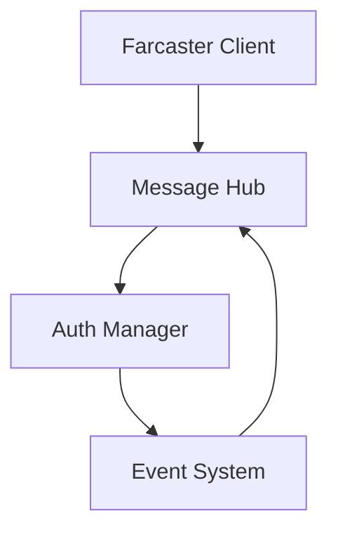
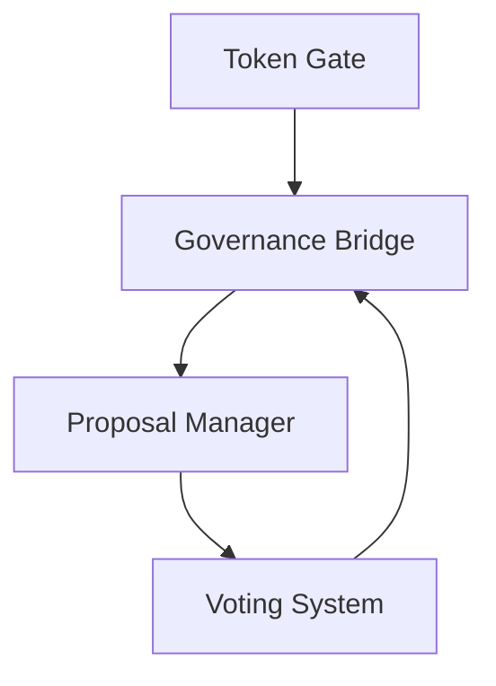
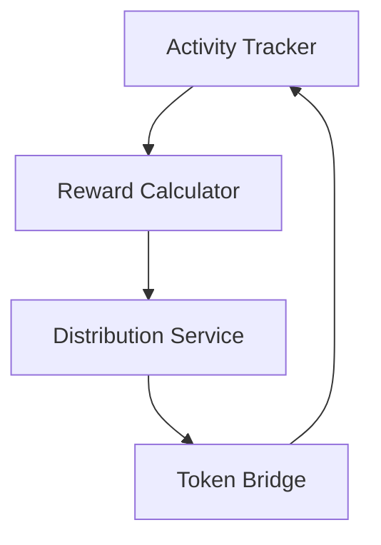

# Farcaster Integration Technical Implementation Plan

## System Architecture

### Components
1. **Core Integration Layer**
   - Farcaster Protocol Client
   - Message Hub Service
   - Authentication Manager
   - Event Dispatcher

2. **DAO Integration Layer**
   - Governance Bridge
   - Token Gate Service
   - Proposal Discussion Manager
   - Voting Integration

3. **Tokenomics Layer**
   - Reward Distribution Service
   - Activity Tracking
   - Incentive Calculator
   - Token Bridge

## Implementation Phases

### Phase 1: Core Setup (Week 1-2)


1. **Environment Setup**
   - Initialize Farcaster development environment
   - Set up local test network
   - Configure development tools
   - Establish CI/CD pipeline

2. **Core Protocol Integration**
   - Implement Farcaster client
   - Set up message hub
   - Configure authentication
   - Establish event system

### Phase 2: DAO Integration (Week 3-4)


1. **Token Gating**
   - Implement token verification
   - Set up access control
   - Configure permission levels
   - Establish role management

2. **Governance Features**
   - Deploy proposal system
   - Implement voting mechanisms
   - Set up discussion threads
   - Configure notification system

### Phase 3: Tokenomics Integration (Week 5-6)


1. **Reward System**
   - Activity tracking implementation
   - Reward calculation engine
   - Distribution mechanism
   - Performance analytics

2. **Incentive Mechanisms**
   ```solidity
   contract MessageRewards {
       // Base reward for active participation
       uint256 public constant BASE_REWARD = 100;
       
       // Multiplier for high-quality content
       uint256 public constant QUALITY_MULTIPLIER = 2;
       
       // Time-based decay factor
       uint256 public constant DECAY_RATE = 95; // 95% per period
       
       struct Reward {
           uint256 baseAmount;
           uint256 qualityBonus;
           uint256 timeMultiplier;
           uint256 totalReward;
       }
       
       mapping(address => Reward) public userRewards;
       
       function calculateReward(
           address user,
           uint256 activityScore,
           uint256 qualityScore,
           uint256 timeElapsed
       ) public view returns (uint256) {
           uint256 baseReward = BASE_REWARD * activityScore;
           uint256 qualityBonus = baseReward * qualityScore * QUALITY_MULTIPLIER / 100;
           uint256 timeDecay = calculateDecay(timeElapsed);
           
           return (baseReward + qualityBonus) * timeDecay / 100;
       }
   }
   ```

## Development Environment Setup

### Prerequisites
```bash
# Required tools
npm install -g @farcaster/hub-web
npm install -g hardhat
npm install -g typescript
```

### Project Structure
```
messaging/
├── contracts/
│   ├── rewards/
│   │   ├── MessageRewards.sol
│   │   └── QualityOracle.sol
│   └── governance/
│       ├── ProposalManager.sol
│       └── VotingSystem.sol
├── src/
│   ├── core/
│   │   ├── FarcasterClient.ts
│   │   └── MessageHub.ts
│   ├── dao/
│   │   ├── TokenGate.ts
│   │   └── ProposalManager.ts
│   └── tokenomics/
│       ├── RewardService.ts
│       └── IncentiveCalculator.ts
└── test/
    ├── integration/
    └── unit/
```

## Reward Mechanism Design

### Activity-Based Rewards
1. **Base Participation**
   - Message posting: 10 tokens
   - Reply engagement: 5 tokens
   - Content reaction: 1 token

2. **Quality Multipliers**
   - Community engagement: 1.5x
   - Proposal participation: 2x
   - Governance activity: 3x

3. **Time-Based Incentives**
   - Early adoption bonus: 2x first month
   - Consistency bonus: +10% per active week
   - Streak rewards: +5% per consecutive day

### Governance Integration
1. **Proposal Discussion Rewards**
   - Proposal creation: 100 tokens
   - Quality comment: 20 tokens
   - Voting participation: 10 tokens

2. **Reputation System**
   - Trust score accumulation
   - Quality contribution tracking
   - Community recognition rewards

## Next Steps

1. **Immediate Actions**
   ```bash
   # Create project structure
   mkdir -p messaging/{contracts,src,test}/{core,dao,tokenomics}
   
   # Initialize development environment
   cd messaging
   npm init -y
   npm install @farcaster/hub-web ethers hardhat
   ```

2. **Development Kickoff**
   - Set up local development environment
   - Create initial smart contracts
   - Begin core integration implementation
   - Configure test environment

3. **Testing Strategy**
   - Unit tests for core components
   - Integration tests for DAO features
   - Performance testing for reward system
   - Security audit preparation
