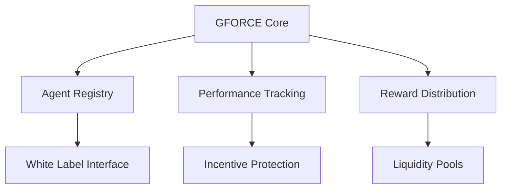

# PRIME: Evolution of Work Blockchain Framework

## Core Philosophy
PRIME represents the Evolution of Work (EOW) through a hybrid blockchain that integrates AI agents (GFORCE) with human governance. The system is designed to be both adaptive and protective of its core incentive structures.

## Framework Layers

### Layer 0: GFORCE Base Layer


#### Agent Framework
1. **Base Agents (GFORCE)**
   - Pre-configured AI agents
   - Core functionality templates
   - Performance metrics
   - Reward mechanisms

2. **White Label System**
   - Custom agent creation interface
   - Template modification tools
   - Governance participation rules
   - Performance tracking integration

### Layer 1: Investment & Staking

#### Liquidity Pools
1. **Proposal Pools**
   - Stake-to-vote mechanism
   - Proposal-specific pools
   - Performance-based rewards
   - Risk/reward balancing

2. **Agent Development Pools**
   - Early investment opportunities
   - Development milestone rewards
   - Performance-based returns
   - Risk mitigation strategies

### Layer 2: Governance & Protection

#### Incentive Protection Mechanisms
1. **Core Rules**
   - Immutable incentive structures
   - System integrity checks
   - Conflict resolution protocols
   - Change impact analysis

2. **Adaptation Framework**
   - Controlled modification paths
   - Impact assessment requirements
   - Rollback mechanisms
   - Version control

## Investment Mechanics

### Proposal Betting System
```solidity
struct ProposalBet {
    uint256 proposalId;
    uint256 stakeAmount;
    uint256 rewardMultiplier;
    uint256 lockPeriod;
    BetType betType;
}

enum BetType {
    Development,    // Bet on development success
    Implementation, // Bet on successful implementation
    Adoption,       // Bet on adoption metrics
    Performance     // Bet on performance outcomes
}
```

### Reward Distribution
1. **Direct Rewards**
   - Proposal success rewards
   - Development milestone rewards
   - Performance-based distributions
   - Staking rewards

2. **Indirect Benefits**
   - Governance weight increase
   - Priority access to new features
   - Reduced fees
   - Enhanced voting power

## System Protection

### Change Management
1. **Impact Analysis Required**
   - Incentive structure effects
   - System stability assessment
   - Performance impact evaluation
   - Risk assessment

2. **Warning Triggers**
   ```typescript
   interface SystemWarning {
       severity: 'low' | 'medium' | 'high' | 'critical';
       impactArea: string[];
       potentialBreakage: string[];
       mitigationSteps: string[];
   }
   ```

### Version Control
1. **State Tracking**
   - System parameter versions
   - Incentive structure changes
   - Governance decision history
   - Performance impact records

2. **Rollback Capability**
   - Emergency brake system
   - Gradual rollback procedures
   - State restoration mechanics
   - Impact mitigation tools

## White Label Integration

### Agent Creation Process
1. **Template Selection**
   - Base agent templates
   - Customization options
   - Performance requirements
   - Governance participation rules

2. **Deployment Rules**
   - Minimum stake requirements
   - Performance bonds
   - Governance participation
   - Reward sharing structure

### Investment Opportunities
1. **Early Stage**
   - Agent development funding
   - Template creation stakes
   - Innovation pools
   - Risk/reward profiles

2. **Growth Stage**
   - Performance-based investment
   - Adoption metrics funding
   - Scaling pools
   - Market expansion stakes

## Governance Participation

### Voting Power
1. **Base Voting**
   - Token-based voting
   - Stake-weighted voting
   - Performance multipliers
   - Time-lock bonuses

2. **Agent Voting**
   - AI agent voting rights
   - Performance-based weight
   - Consensus requirements
   - Override mechanisms

## Warning System

### Change Impact Warnings
```typescript
interface ChangeImpact {
    type: 'incentive' | 'performance' | 'governance' | 'system';
    severity: number; // 1-10
    affectedComponents: string[];
    breakageRisk: {
        likelihood: number; // 1-10
        impact: number; // 1-10
        mitigationPossible: boolean;
    };
    recommendations: string[];
}
```

### Protection Mechanisms
1. **Automatic Checks**
   - Incentive structure integrity
   - System parameter bounds
   - Performance impact thresholds
   - Governance balance checks

2. **Manual Reviews**
   - Expert assessment requirements
   - Community feedback periods
   - Staged implementation plans
   - Rollback preparation
