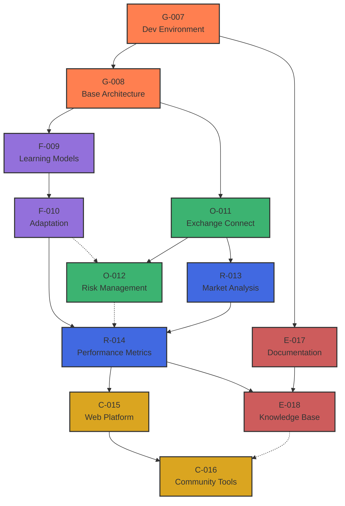

# SKENAI Proposal Network

## Mycelial Network Visualization

### Track-Level Network


### Series-Based View
```mermaid
graph LR
    classDef foundation fill:#ff9999,stroke:#333,stroke-width:2px
    classDef core fill:#99ff99,stroke:#333,stroke-width:2px
    classDef integration fill:#9999ff,stroke:#333,stroke-width:2px
    classDef launch fill:#ffff99,stroke:#333,stroke-width:2px
    
    %% Foundation Series (F1)
    subgraph F1[Foundation Series]
        F1_G007[G-007<br/>Dev Environment]:::foundation
        F1_G008[G-008<br/>Architecture]:::foundation
        F1_E017[E-017<br/>Documentation]:::foundation
        F1_G007 --> F1_G008
        F1_G007 --> F1_E017
    end
    
    %% Core Development Series (C1)
    subgraph C1[Core Development Series]
        C1_F009[F-009<br/>Learning Models]:::core
        C1_F010[F-010<br/>Adaptation]:::core
        C1_O011[O-011<br/>Exchange]:::core
        C1_O012[O-012<br/>Risk]:::core
        C1_R013[R-013<br/>Market Analysis]:::core
        C1_F009 --> C1_F010
        C1_O011 --> C1_O012
        C1_O011 --> C1_R013
    end
    
    %% Integration Series (I1)
    subgraph I1[Integration Series]
        I1_R014[R-014<br/>Metrics]:::integration
        I1_E018[E-018<br/>Knowledge Base]:::integration
        I1_R014 --> I1_E018
    end
    
    %% Launch Series (L1)
    subgraph L1[Launch Series]
        L1_C015[C-015<br/>Web Platform]:::launch
        L1_C016[C-016<br/>Community]:::launch
        L1_C015 --> L1_C016
    end
    
    %% Inter-series connections
    F1 --> C1
    C1 --> I1
    I1 --> L1

## Network Properties

### Track Dependencies
- Genesis → Fractal: Architecture enables learning models
- Genesis → Options: Architecture supports exchange integration
- Fractal → Research: Adaptation informs metrics
- Options → Research: Trading data feeds analysis
- Research → Community: Metrics guide platform development
- Encyclic: Documents and connects all tracks

### Series Flow
1. **Foundation (F1)**
   - Establishes core infrastructure
   - Budget: $23,500
   - Dependencies: None

2. **Core Development (C1)**
   - Builds primary functionality
   - Budget: $44,000
   - Dependencies: F1

3. **Integration (I1)**
   - Connects components
   - Budget: $14,000
   - Dependencies: C1

4. **Launch (L1)**
   - Delivers user-facing features
   - Budget: $18,500
   - Dependencies: I1

### Cross-Track Synergies
1. **Learning-Trading Nexus**
   - Fractal → Options
   - Adaptive trading strategies

2. **Analysis Pipeline**
   - Options → Research
   - Market data analysis

3. **Knowledge Flow**
   - Research → Encyclic
   - Documentation of findings

4. **User Experience**
   - Encyclic → Community
   - Knowledge base integration
