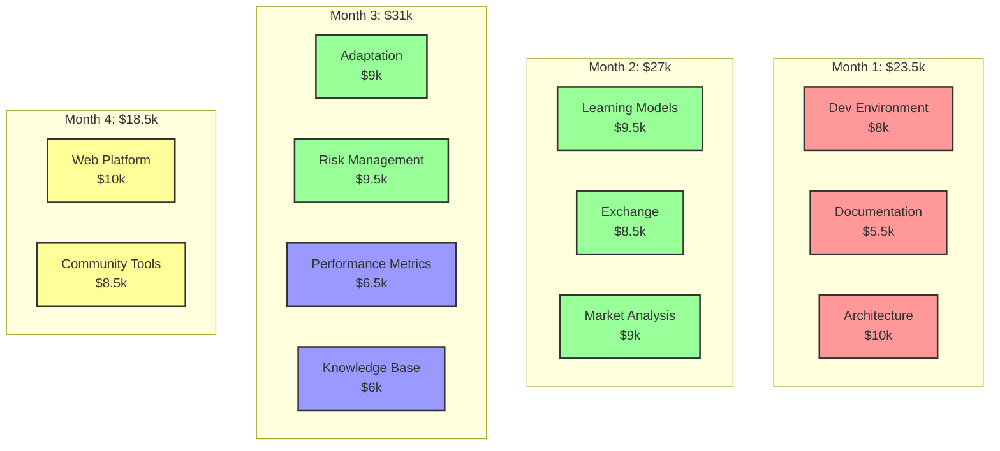
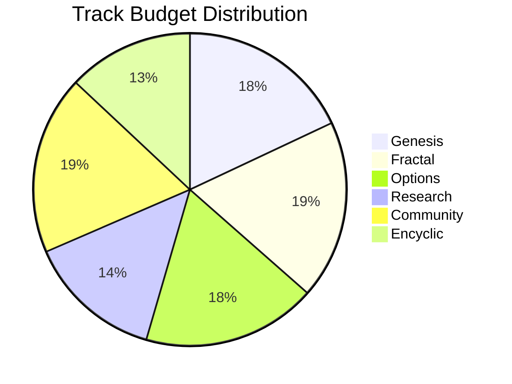
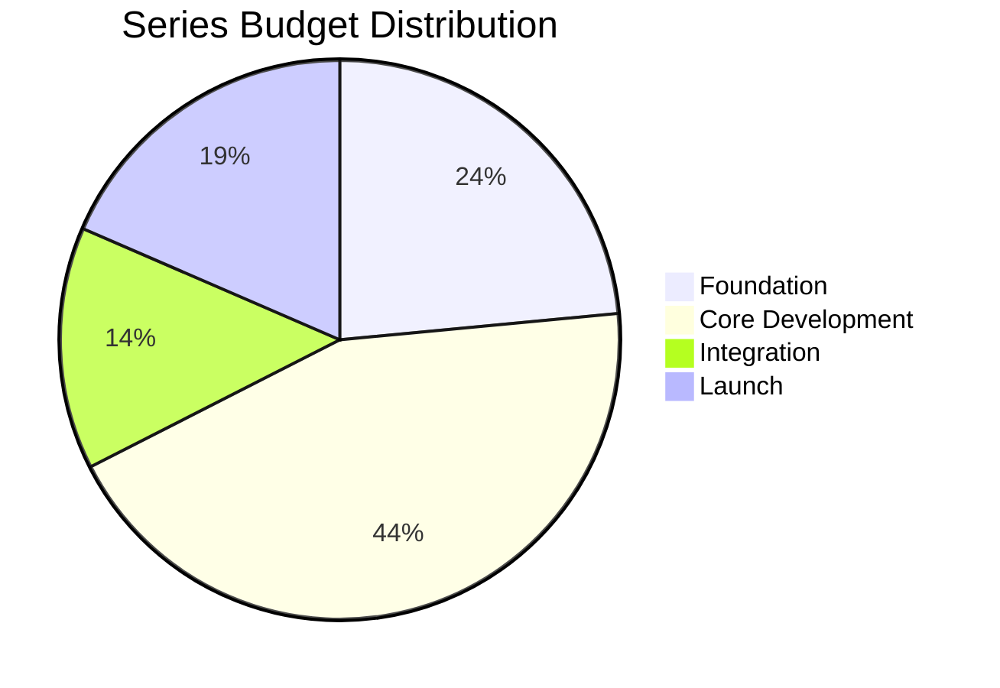

# SKENAI Resource Flow Analysis

## Budget Flow Visualization

```mermaid
sankey-beta
    %% Node definitions
    Foundation[$23.5k Foundation]
    CoreDev[$44k Core Dev]
    Integration[$14k Integration]
    Launch[$18.5k Launch]
    
    Genesis[$18k Genesis]
    Fractal[$18.5k Fractal]
    Options[$18k Options]
    Research[$14k Research]
    Community[$18.5k Community]
    Encyclic[$13k Encyclic]
    
    %% Series to Track flows
    Foundation->Genesis: 18k
    Foundation->Encyclic: 5.5k
    
    CoreDev->Fractal: 18.5k
    CoreDev->Options: 18k
    CoreDev->Research: 7.5k
    
    Integration->Research: 6.5k
    Integration->Encyclic: 7.5k
    
    Launch->Community: 18.5k
```

## Resource Allocation Timeline



## Monthly Resource Distribution

### Month 1 ($23,500)
- **Development Focus**: Infrastructure & Architecture
- **Track Distribution**:
  - Genesis: $18,000 (76.6%)
  - Encyclic: $5,500 (23.4%)
- **Key Deliverables**:
  - Development environment
  - Base architecture
  - Documentation system

### Month 2 ($27,000)
- **Development Focus**: Core Systems
- **Track Distribution**:
  - Fractal: $9,500 (35.2%)
  - Options: $8,500 (31.5%)
  - Research: $9,000 (33.3%)
- **Key Deliverables**:
  - Learning models
  - Exchange connectivity
  - Market analysis framework

### Month 3 ($31,000)
- **Development Focus**: Integration & Testing
- **Track Distribution**:
  - Fractal: $9,000 (29%)
  - Options: $9,500 (30.6%)
  - Research: $6,500 (21%)
  - Encyclic: $6,000 (19.4%)
- **Key Deliverables**:
  - Adaptation mechanisms
  - Risk management
  - Performance metrics
  - Knowledge base

### Month 4 ($18,500)
- **Development Focus**: Launch & Community
- **Track Distribution**:
  - Community: $18,500 (100%)
- **Key Deliverables**:
  - Web platform
  - Community tools

## Resource Flow Patterns

### Track-Based Flow
1. **Genesis Track** ($18,000)
   - Front-loaded in Month 1
   - Enables all subsequent development

2. **Fractal Track** ($18,500)
   - Split between Months 2 and 3
   - Focuses on learning and adaptation

3. **Options Track** ($18,000)
   - Split between Months 2 and 3
   - Trading and risk management focus

4. **Research Track** ($14,000)
   - Distributed across Months 2 and 3
   - Analysis and metrics development

5. **Community Track** ($18,500)
   - Concentrated in Month 4
   - Platform and user tools

6. **Encyclic Track** ($13,000)
   - Initial setup in Month 1
   - Knowledge base in Month 3

### Resource Optimization
1. **Even Distribution**:
   - Average monthly spend: ~$25,000
   - Peak in Month 3: $31,000
   - Valley in Month 4: $18,500

2. **Critical Path Focus**:
   - Infrastructure (Month 1)
   - Core Systems (Month 2)
   - Integration (Month 3)
   - Launch (Month 4)

3. **Risk Management**:
   - Front-loaded critical components
   - Balanced mid-phase resource allocation
   - Dedicated launch phase budget

## Budget Efficiency Metrics

### Cost per Track


### Series Investment Profile

