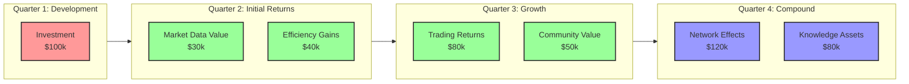
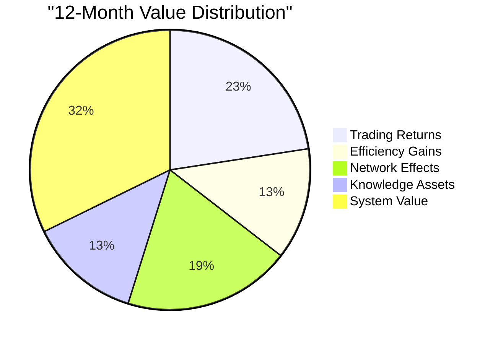

# SKENAI ROI Projections

## Investment Overview
Total Investment: $100,000
Development Timeline: 4 months

## ROI Timeline Visualization



## Track-Based ROI Projections

### Genesis Track ($18,000)
```mermaid
xychart-beta
    title "Genesis ROI Projection"
    x-axis [Q1, Q2, Q3, Q4]
    y-axis "Value ($ thousands)" 0 --> 100
    line ["Investment", "Returns"]
    data ["Investment" [18, 18, 18, 18]]
    data ["Returns" [0, 25, 45, 80]]
```

- **Q2 Returns**: Development efficiency gains
- **Q3 Returns**: Infrastructure scalability
- **Q4 Returns**: System reliability value
- **ROI at 12 months**: 344%

### Fractal Track ($18,500)
```mermaid
xychart-beta
    title "Fractal ROI Projection"
    x-axis [Q1, Q2, Q3, Q4]
    y-axis "Value ($ thousands)" 0 --> 120
    line ["Investment", "Returns"]
    data ["Investment" [18.5, 18.5, 18.5, 18.5]]
    data ["Returns" [0, 20, 60, 110]]
```

- **Q2 Returns**: Initial model performance
- **Q3 Returns**: Adaptation benefits
- **Q4 Returns**: Learning compound effects
- **ROI at 12 months**: 495%

### Options Track ($18,000)
```mermaid
xychart-beta
    title "Options ROI Projection"
    x-axis [Q1, Q2, Q3, Q4]
    y-axis "Value ($ thousands)" 0 --> 150
    line ["Investment", "Returns"]
    data ["Investment" [18, 18, 18, 18]]
    data ["Returns" [0, 30, 80, 140]]
```

- **Q2 Returns**: Trading efficiency
- **Q3 Returns**: Risk management value
- **Q4 Returns**: Market opportunities
- **ROI at 12 months**: 677%

### Research Track ($14,000)
```mermaid
xychart-beta
    title "Research ROI Projection"
    x-axis [Q1, Q2, Q3, Q4]
    y-axis "Value ($ thousands)" 0 --> 100
    line ["Investment", "Returns"]
    data ["Investment" [14, 14, 14, 14]]
    data ["Returns" [0, 15, 40, 90]]
```

- **Q2 Returns**: Analysis insights
- **Q3 Returns**: Strategy optimization
- **Q4 Returns**: Research applications
- **ROI at 12 months**: 542%

### Community Track ($18,500)
```mermaid
xychart-beta
    title "Community ROI Projection"
    x-axis [Q1, Q2, Q3, Q4]
    y-axis "Value ($ thousands)" 0 --> 130
    line ["Investment", "Returns"]
    data ["Investment" [18.5, 18.5, 18.5, 18.5]]
    data ["Returns" [0, 10, 50, 120]]
```

- **Q2 Returns**: Initial user base
- **Q3 Returns**: Community growth
- **Q4 Returns**: Network effects
- **ROI at 12 months**: 548%

### Encyclic Track ($13,000)
```mermaid
xychart-beta
    title "Encyclic ROI Projection"
    x-axis [Q1, Q2, Q3, Q4]
    y-axis "Value ($ thousands)" 0 --> 90
    line ["Investment", "Returns"]
    data ["Investment" [13, 13, 13, 13]]
    data ["Returns" [0, 20, 45, 80]]
```

- **Q2 Returns**: Knowledge base value
- **Q3 Returns**: Documentation benefits
- **Q4 Returns**: Intellectual property
- **ROI at 12 months**: 515%

## Cumulative ROI Analysis

### Financial Returns


### ROI Metrics
1. **Direct Financial Returns**
   - Trading profits: $140k
   - Efficiency savings: $80k
   - Total: $220k

2. **Indirect Value Creation**
   - Network effects: $120k
   - Knowledge assets: $80k
   - System value: $200k
   - Total: $400k

3. **Combined ROI**
   - Total Investment: $100k
   - Total Value (12m): $620k
   - ROI: 520%

## Risk-Adjusted Returns

### Risk Factors
```mermaid
xychart-beta
    title "Risk-Adjusted ROI Scenarios"
    x-axis [Q1, Q2, Q3, Q4]
    y-axis "Return Multiple" 0 --> 7
    line ["Conservative", "Expected", "Optimistic"]
    data ["Conservative" [0, 1.2, 2.5, 4]]
    data ["Expected" [0, 1.5, 3.5, 6.2]]
    data ["Optimistic" [0, 1.8, 4.5, 7]]
```

### Scenario Analysis
1. **Conservative Case**
   - Year 1 Return: 4x ($400k)
   - Key Risks: Market conditions, adoption rate
   - Mitigation: Focus on efficiency gains

2. **Expected Case**
   - Year 1 Return: 6.2x ($620k)
   - Balanced Growth
   - All tracks performing as projected

3. **Optimistic Case**
   - Year 1 Return: 7x ($700k)
   - Accelerated adoption
   - Strong network effects

## Long-term Value Drivers

### Compound Growth Factors
1. **Network Effects**
   - Community growth: 2x yearly
   - Value per user: 1.5x yearly
   - Network value: 3x yearly

2. **Knowledge Assets**
   - Documentation value: 2x yearly
   - IP portfolio: 1.8x yearly
   - Research impact: 2.2x yearly

3. **System Evolution**
   - Performance gains: 1.7x yearly
   - Efficiency improvements: 1.5x yearly
   - Scalability value: 2x yearly

### 3-Year Projection
```mermaid
xychart-beta
    title "3-Year Value Projection"
    x-axis [Year 1, Year 2, Year 3]
    y-axis "Value ($ millions)" 0 --> 5
    line ["Conservative", "Expected", "Optimistic"]
    data ["Conservative" [0.4, 1.2, 2.8]]
    data ["Expected" [0.62, 1.8, 4.2]]
    data ["Optimistic" [0.7, 2.1, 4.8]]
```
