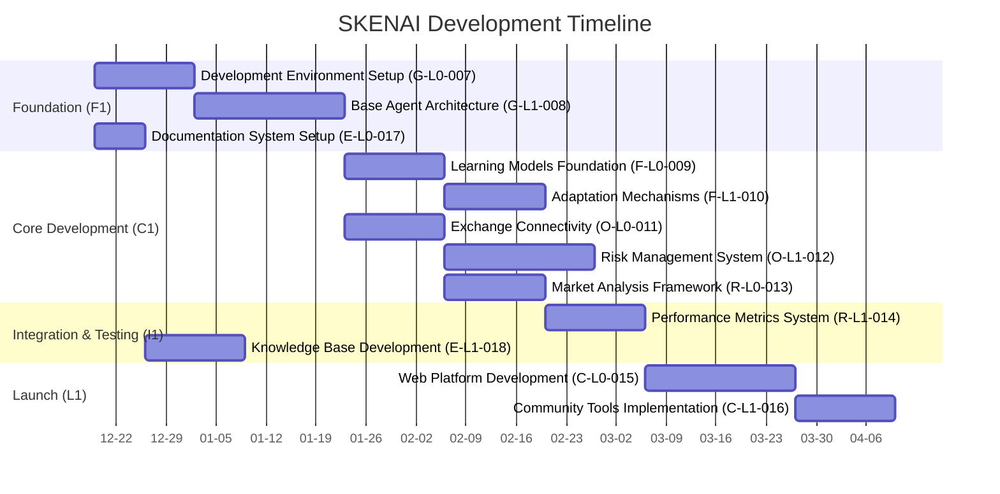

# SKENAI Development Timeline

## Overview
This document provides a visual representation of the SKENAI development timeline, organized by series and tracks.

## Timeline Visualization

## Series Overview

### Foundation Series (F1)
- Total Budget: $23,500
- Duration: 42 days
- Key Deliverables:
  - Development environment
  - Base agent architecture
  - Documentation system

### Core Development Series (C1)
- Total Budget: $44,000
- Duration: 63 days
- Key Deliverables:
  - Learning models
  - Exchange integration
  - Market analysis framework

### Integration & Testing Series (I1)
- Total Budget: $14,000
- Duration: 28 days
- Key Deliverables:
  - Performance metrics
  - Knowledge base

### Launch Series (L1)
- Total Budget: $18,500
- Duration: 35 days
- Key Deliverables:
  - Web platform
  - Community tools

## Track Distribution

### Genesis (G)
- Budget: $18,000
- Proposals: 2
- Focus: Foundation and architecture

### Fractal (F)
- Budget: $18,500
- Proposals: 2
- Focus: Learning and adaptation

### Options (O)
- Budget: $18,000
- Proposals: 2
- Focus: Exchange integration and risk management

### Research (R)
- Budget: $14,000
- Proposals: 2
- Focus: Market analysis and metrics

### Community (C)
- Budget: $18,500
- Proposals: 2
- Focus: Platform and tools

### Encyclic (E)
- Budget: $13,000
- Proposals: 2
- Focus: Documentation and knowledge management

## Critical Path
1. Development Environment Setup (14d)
2. Base Agent Architecture (21d)
3. Exchange Connectivity (14d)
4. Risk Management System (21d)
5. Performance Metrics System (14d)
6. Web Platform Development (21d)
7. Community Tools Implementation (14d)

Total Critical Path Duration: 119 days
