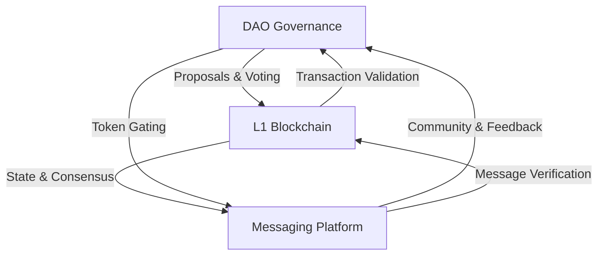

# SKENAI Deployment Guide

## System Components Integration

### 1. Core Infrastructure Triangle


### 2. Component Dependencies

#### A. DAO → L1 Chain
- Governance proposals stored on-chain
- Voting results validated by consensus
- Token distribution and tracking
- Performance metrics validation

#### B. L1 Chain → Messaging
- Message authentication
- Transaction verification
- State synchronization
- Performance tracking

#### C. Messaging → DAO
- Proposal discussions
- Community feedback
- Governance notifications
- Agent communications

## Deployment Sequence

### Phase 1: Foundation
1. **L1 Chain Core**
   - Consensus mechanism
   - Block validation
   - Network security
   - Basic transaction support

2. **Basic DAO Structure**
   - Token contracts
   - Basic governance
   - Access control
   - Proposal framework

3. **Messaging Infrastructure**
   - Farcaster integration
   - Basic messaging
   - Authentication
   - Storage system

### Phase 2: Integration
1. **DAO-Chain Bridge**
   ```solidity
   interface IDAOChainBridge {
       function submitProposal(bytes32 proposalHash) external;
       function validateVote(address voter, uint256 weight) external;
       function executeProposal(uint256 proposalId) external;
   }
   ```

2. **Chain-Messaging Bridge**
   ```solidity
   interface IChainMessageBridge {
       function verifyMessage(bytes32 messageHash) external;
       function trackPerformance(address user) external;
       function syncState(bytes32 stateRoot) external;
   }
   ```

3. **Messaging-DAO Bridge**
   ```typescript
   interface IMessageDAOBridge {
       submitFeedback(proposalId: number, feedback: string): Promise<void>;
       notifyGovernance(event: GovernanceEvent): Promise<void>;
       trackParticipation(user: string): Promise<void>;
   }
   ```

### Phase 3: Enhancement
1. **Advanced Features**
   - Cross-component transactions
   - Unified state management
   - Performance optimization
   - Security hardening

2. **Integration Testing**
   - Component interaction tests
   - Performance benchmarks
   - Security audits
   - Stress testing

## Component-Specific Guidelines

### 1. L1 Blockchain Deployment
```bash
# Initialize network
prime-chain init --network mainnet

# Deploy consensus
prime-chain deploy consensus --type POS

# Start validators
prime-chain validator start --count 7
```

### 2. DAO Deployment
```bash
# Deploy core contracts
npx hardhat deploy --network prime-mainnet --tags dao-core

# Initialize governance
npx hardhat run scripts/init-governance.ts

# Set up bridges
npx hardhat deploy --tags bridges
```

### 3. Messaging Platform
```bash
# Initialize Farcaster client
npm run init-farcaster

# Deploy message bridges
npm run deploy-bridges

# Start message sync
npm run start-sync
```

## Security Considerations

### Cross-Component Security
1. **Authentication Flow**
   ```mermaid
   sequenceDiagram
       participant User
       participant Messaging
       participant Chain
       participant DAO
       
       User->>Messaging: Send Message
       Messaging->>Chain: Verify User
       Chain->>DAO: Check Permissions
       DAO-->>Chain: Return Status
       Chain-->>Messaging: Confirm Auth
       Messaging-->>User: Confirm Send
   ```

2. **State Consistency**
   - Atomic transactions across components
   - State root synchronization
   - Rollback mechanisms
   - Conflict resolution

### Emergency Procedures
1. **Component Isolation**
   - Individual component shutdown
   - Bridge deactivation
   - State preservation
   - Recovery process

2. **Data Recovery**
   - State snapshots
   - Transaction logs
   - Message history
   - Governance records

## Monitoring & Maintenance

### Health Checks
```typescript
interface SystemHealth {
    l1Chain: {
        blockHeight: number;
        validators: number;
        syncStatus: boolean;
    };
    dao: {
        activeProposals: number;
        voterParticipation: number;
        tokenMetrics: TokenMetrics;
    };
    messaging: {
        activeUsers: number;
        messageLatency: number;
        syncStatus: boolean;
    };
}
```

### Performance Metrics
1. **Cross-Component Metrics**
   - Transaction throughput
   - Message delivery time
   - Governance response time
   - State sync latency

2. **Resource Usage**
   - Network bandwidth
   - Storage requirements
   - Computation load
   - Memory utilization

## Upgrade Procedures

### Coordinated Updates
1. **Preparation**
   - Component version compatibility
   - State migration plans
   - Rollback procedures
   - User communication

2. **Execution**
   - Sequential component updates
   - Bridge adaptation
   - State verification
   - Performance validation
