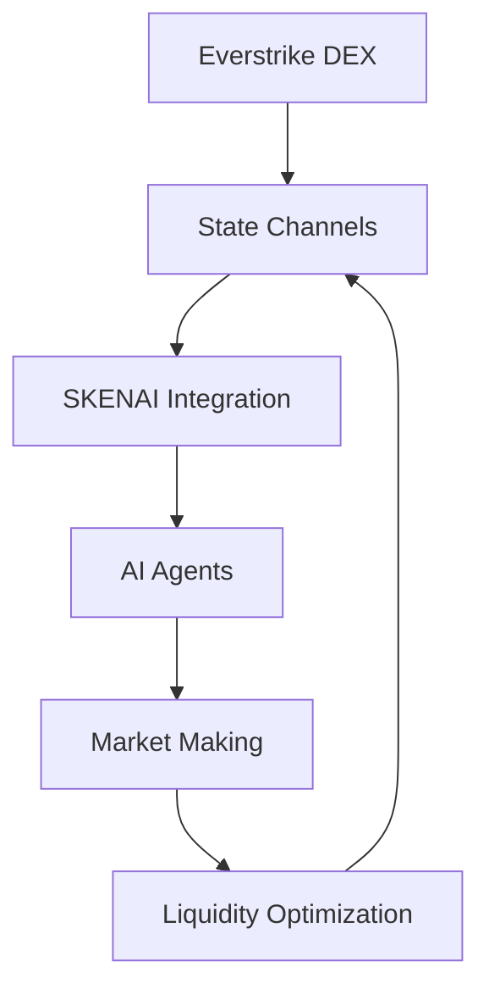

# Everstrike Integration Guide

## Overview

This guide details the technical integration between SKENAI's AI-driven market making system and Everstrike's hybrid perpetual options DEX. The integration leverages Everstrike's state channel architecture while enhancing it with SKENAI's advanced AI capabilities.

## System Architecture

### 1. Core Components



### 2. Contract Architecture

```solidity
// Main integration points
interface IEverstrikeIntegration {
    function optimizeChannel(bytes32 channelId) external returns (bool);
    function addLiquidity(bytes32 channelId, uint256 amount) external;
    function removeLiquidity(bytes32 channelId, uint256 amount) external;
}

// State channel optimization
interface IStateChannelOptimizer {
    function optimizeParameters(bytes32 channelId) external returns (bool);
    function monitorHealth(bytes32 channelId) external view returns (ChannelHealth);
}
```

## Integration Steps

### 1. Initial Setup

#### Environment Configuration
```bash
# Install dependencies
npm install @everstrike/sdk @skenai/core

# Configure environment
export EVERSTRIKE_API_KEY="your_api_key"
export SKENAI_NODE_URL="your_node_url"
```

#### Contract Deployment
```typescript
async function deployIntegration() {
    // Deploy main integration contract
    const EverstrikeIntegration = await ethers.getContractFactory("EverstrikeIntegration");
    const integration = await EverstrikeIntegration.deploy();
    await integration.deployed();
    
    // Deploy optimizer
    const StateChannelOptimizer = await ethers.getContractFactory("StateChannelOptimizer");
    const optimizer = await StateChannelOptimizer.deploy(integration.address);
    await optimizer.deployed();
    
    return { integration, optimizer };
}
```

### 2. State Channel Integration

#### Channel Setup
```typescript
async function setupChannel(channelId: string) {
    // Initialize channel metrics
    await integration.initializeChannel(channelId, {
        minLiquidity: ethers.utils.parseEther("10"),
        maxUtilization: 80,
        targetEfficiency: 90,
        riskThreshold: 50
    });
    
    // Start optimization
    await optimizer.startOptimization(channelId);
}
```

#### Health Monitoring
```typescript
async function monitorChannel(channelId: string) {
    // Set up event listeners
    integration.on("ChannelOptimized", (channelId, efficiency) => {
        console.log(`Channel ${channelId} optimized with efficiency ${efficiency}`);
    });
    
    // Monitor health
    const health = await optimizer.getChannelHealth(channelId);
    console.log("Channel Health:", health);
}
```

### 3. AI Agent Integration

#### Agent Deployment
```typescript
class MarketMakingAgent {
    constructor(channelId: string, integration: Contract) {
        this.channelId = channelId;
        this.integration = integration;
    }
    
    async start() {
        // Initialize AI model
        await this.initializeModel();
        
        // Start market making
        await this.startMarketMaking();
    }
    
    async optimizeParameters() {
        const metrics = await this.integration.getChannelMetrics(this.channelId);
        const optimal = await this.calculateOptimalParams(metrics);
        await this.integration.updateParameters(this.channelId, optimal);
    }
}
```

#### Strategy Implementation
```typescript
class MarketMakingStrategy {
    async execute(orderBook: OrderBook, metrics: ChannelMetrics) {
        // Calculate optimal positions
        const positions = await this.calculateOptimalPositions(orderBook);
        
        // Execute trades
        for (const position of positions) {
            await this.executeTrade(position);
        }
        
        // Update metrics
        await this.updateMetrics(metrics);
    }
}
```

### 4. Liquidity Management

#### Adding Liquidity
```typescript
async function addLiquidity(channelId: string, amount: BigNumber) {
    // Approve tokens
    await token.approve(integration.address, amount);
    
    // Add liquidity
    await integration.addLiquidity(channelId, amount);
}
```

#### Removing Liquidity
```typescript
async function removeLiquidity(channelId: string, amount: BigNumber) {
    // Check health
    const health = await optimizer.getChannelHealth(channelId);
    if (health.isHealthy) {
        await integration.removeLiquidity(channelId, amount);
    }
}
```

## Testing and Deployment

### 1. Local Testing
```bash
# Run local tests
npx hardhat test test/integration.test.ts

# Run simulation
npx hardhat run scripts/simulate.ts
```

### 2. Testnet Deployment
```bash
# Deploy to testnet
npx hardhat run scripts/deploy.ts --network everstrike_testnet

# Verify contracts
npx hardhat verify --network everstrike_testnet [CONTRACT_ADDRESS]
```

### 3. Production Deployment
```bash
# Deploy to mainnet
npx hardhat run scripts/deploy.ts --network everstrike_mainnet

# Set up monitoring
pm2 start monitoring.js
```

## Security Considerations

### 1. State Channel Security
- Regular health checks
- Emergency pause functionality
- Multi-signature controls
- Rate limiting

### 2. AI Agent Security
- Model validation
- Strategy limits
- Position caps
- Performance monitoring

### 3. Integration Security
- Access controls
- Parameter bounds
- Circuit breakers
- Audit requirements

## Monitoring and Maintenance

### 1. Health Monitoring
```typescript
class HealthMonitor {
    async monitor() {
        // Monitor channel health
        const health = await this.checkChannelHealth();
        
        // Monitor AI performance
        const performance = await this.checkAIPerformance();
        
        // Monitor integration status
        const status = await this.checkIntegrationStatus();
        
        return { health, performance, status };
    }
}
```

### 2. Performance Optimization
```typescript
class PerformanceOptimizer {
    async optimize() {
        // Optimize gas usage
        await this.optimizeGas();
        
        // Optimize execution speed
        await this.optimizeExecution();
        
        // Optimize capital efficiency
        await this.optimizeCapital();
    }
}
```

## Troubleshooting

### Common Issues and Solutions

1. **Channel Initialization Failed**
   - Check network connection
   - Verify parameters
   - Ensure sufficient gas

2. **AI Agent Not Responding**
   - Check model status
   - Verify data feed
   - Restart agent

3. **Liquidity Issues**
   - Check token balances
   - Verify approvals
   - Check health status

## Support and Resources

### Documentation
- [Everstrike API Docs](https://docs.testnet.everstrike.io/)
- [SKENAI Integration Docs](../docs/integration/)
- [Smart Contract Reference](../contracts/README.md)

### Support Channels
- Technical Support: [Contact]
- Integration Support: [Contact]
- Emergency Support: [Contact]

---

*For additional support or questions, please contact the SKENAI integration team.*
