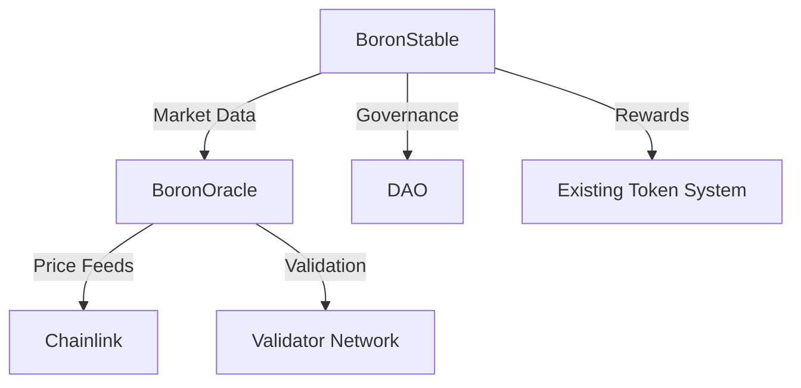

# Boron-Backed Stablecoin (BRST) Proposal

## Executive Summary
This proposal introduces BRST (Boron Stable Token), a novel stablecoin pegged to the market value of Boron. Unlike traditional stablecoins, BRST maintains its $1.00 peg through supply adjustments based on real-world Boron market dynamics.

## Technical Architecture

### Core Components
1. **BoronStable Contract**
   - ERC20-compliant stablecoin
   - Supply adjustment mechanism
   - Price stability controls
   - Integration with existing DAO infrastructure

2. **BoronOracle System**
   - Chainlink-powered market data feeds
   - Validator network for data verification
   - Historical data tracking
   - Market analytics

### Integration Points

## Market Mechanics

### Supply Adjustment
- Supply increases when Boron demand exceeds supply
- Supply decreases when Boron supply exceeds demand
- Adjustments maintain $1.00 peg
- Built-in cooldown periods prevent manipulation

### Oracle System
- Multiple data sources for Boron market data
- Validator network for data verification
- Chainlink integration for reliable price feeds
- Historical data analysis for trend detection

## Economic Model

### Token Distribution
1. **Initial Supply**: 1,000,000 BRST
2. **Distribution**:
   - 40% - Market Operations
   - 30% - DAO Treasury
   - 20% - Validator Rewards
   - 10% - Development Fund

### Validator Economics
1. **Stake Requirements**:
   - Minimum Stake: 1,000 tokens
   - Lock Period: 30 days
   - Performance Bonds

2. **Rewards**:
   - Market Data Updates: 10 BRST
   - Accurate Validations: 5 BRST
   - Monthly Performance Bonus

## Integration with Existing Systems

### DAO Integration
1. **Governance**
   - Parameter adjustments through DAO voting
   - Oracle network management
   - Validator approval process

2. **Token System**
   - Compatible with existing rewards
   - Integrated with messaging platform
   - Cross-chain capabilities

### Security Measures
1. **Oracle Security**
   - Multiple data sources
   - Validator stake requirements
   - Manipulation protection
   - Emergency shutdown capability

2. **Smart Contract Security**
   - Access control system
   - Rate limiting
   - Circuit breakers
   - Upgrade mechanism

## Development Roadmap

### Phase 1: Foundation (Weeks 1-4)
1. **Week 1**
   - Smart contract development
   - Oracle system setup
   - Initial testing

2. **Week 2-3**
   - Validator network setup
   - Integration testing
   - Security audits

3. **Week 4**
   - Deployment preparation
   - Documentation
   - Community education

### Phase 2: Launch (Weeks 5-8)
1. **Week 5**
   - Testnet deployment
   - Validator onboarding
   - Integration testing

2. **Week 6-7**
   - Mainnet preparation
   - Security checks
   - Community engagement

3. **Week 8**
   - Mainnet launch
   - Market operations start
   - Monitoring system activation

## Resource Requirements

### Development Resources
1. **Smart Contracts**
   - Solidity developers
   - Security auditors
   - Integration specialists

2. **Oracle System**
   - Chainlink integration
   - Data source APIs
   - Validator software

### Infrastructure
1. **Network**
   - Validator nodes
   - Oracle nodes
   - Monitoring systems

2. **Security**
   - Audit budget
   - Bug bounty program
   - Emergency response team

## Risk Analysis

### Technical Risks
1. **Oracle Manipulation**
   - Multiple data sources
   - Validator stake requirements
   - Time-weighted averages

2. **Smart Contract Vulnerabilities**
   - Comprehensive testing
   - Multiple audits
   - Gradual rollout

### Market Risks
1. **Price Stability**
   - Supply adjustment mechanism
   - Market operation fund
   - Emergency procedures

2. **Validator Network**
   - Stake requirements
   - Performance monitoring
   - Slashing conditions

## Success Metrics

### Technical Metrics
1. **System Performance**
   - Transaction throughput
   - Oracle response time
   - Validator participation

2. **Security Metrics**
   - Incident count
   - Response time
   - Recovery speed

### Market Metrics
1. **Price Stability**
   - Peg maintenance
   - Supply adjustments
   - Market operations

2. **Adoption Metrics**
   - Trading volume
   - Validator count
   - Market integration

## Conclusion
The BRST system represents a novel approach to stablecoin design, leveraging real-world Boron market dynamics to maintain price stability. The integration with our existing DAO infrastructure and the robust oracle system provides a solid foundation for success.

## Voting
- Start Date: [Current Date + 1 week]
- End Date: [Start Date + 2 weeks]
- Quorum: 51%
- Approval Threshold: 67%
