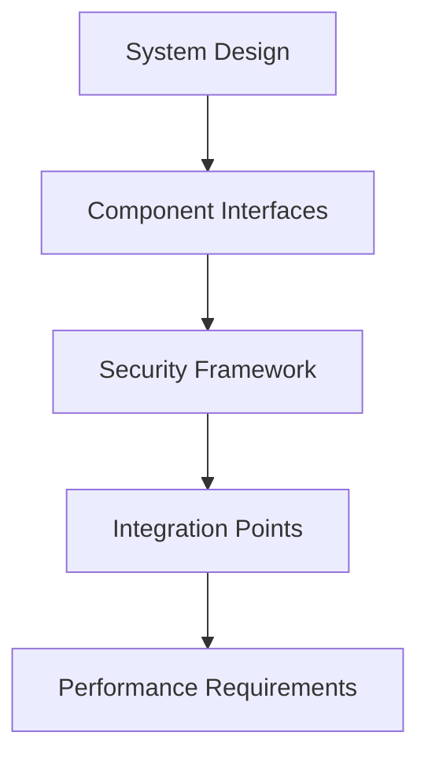
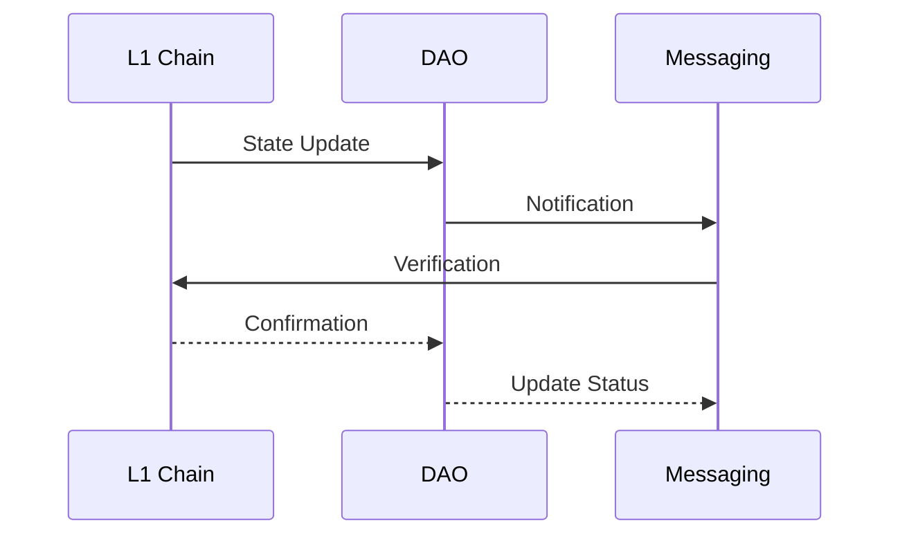
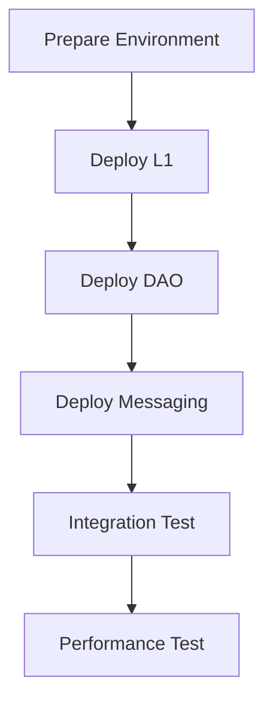

# SKENAI Phase Details

## Phase 1: Foundation (Weeks 1-4)

### Week 1: Core Architecture


#### Daily Breakdown
1. **Day 1-2: System Architecture**
   - Morning: Core design sessions
   - Afternoon: Interface definitions
   - Evening: Documentation

2. **Day 3-4: Security Framework**
   - Morning: Threat modeling
   - Afternoon: Security protocols
   - Evening: Review & updates

3. **Day 5: Integration Planning**
   - Morning: Component mapping
   - Afternoon: Interface testing
   - Evening: Documentation

### Week 2: L1 Chain Foundation
```solidity
// Core consensus implementation
contract ConsensusEngine {
    function initialize() external {
        // Implementation
    }
    
    function configureValidators() external {
        // Implementation
    }
    
    function setupNetwork() external {
        // Implementation
    }
}
```

#### Daily Breakdown
1. **Day 1-2: Consensus**
   - Morning: Algorithm implementation
   - Afternoon: Testing
   - Evening: Documentation

2. **Day 3-4: Network**
   - Morning: P2P implementation
   - Afternoon: Node testing
   - Evening: Performance tuning

3. **Day 5: Integration**
   - Morning: Component testing
   - Afternoon: Bug fixes
   - Evening: Documentation

### Week 3: DAO Implementation
```typescript
interface DAOConfig {
    votingPeriod: number;
    proposalThreshold: number;
    executionDelay: number;
    quorumPercentage: number;
}

class DAOImplementation {
    async initialize(config: DAOConfig): Promise<void> {
        // Implementation
    }
    
    async setupGovernance(): Promise<void> {
        // Implementation
    }
}
```

#### Daily Breakdown
1. **Day 1-2: Governance**
   - Morning: Contract development
   - Afternoon: Testing
   - Evening: Documentation

2. **Day 3-4: Tokenomics**
   - Morning: Economic model
   - Afternoon: Implementation
   - Evening: Testing

3. **Day 5: Integration**
   - Morning: Bridge testing
   - Afternoon: Performance
   - Evening: Documentation

### Week 4: Messaging Setup
```typescript
interface MessagingConfig {
    encryption: boolean;
    compression: boolean;
    maxSize: number;
    timeout: number;
}

class MessagingSetup {
    async initialize(config: MessagingConfig): Promise<void> {
        // Implementation
    }
    
    async configureBridges(): Promise<void> {
        // Implementation
    }
}
```

## Phase 2: Integration (Weeks 5-8)

### Week 5: Cross-Component Communication


#### Daily Breakdown
1. **Day 1-2: Bridge Implementation**
   - Morning: Contract development
   - Afternoon: Testing
   - Evening: Documentation

2. **Day 3-4: State Sync**
   - Morning: Sync implementation
   - Afternoon: Testing
   - Evening: Performance tuning

3. **Day 5: Security**
   - Morning: Audit
   - Afternoon: Fixes
   - Evening: Documentation

### Week 6: Performance Optimization
```typescript
interface OptimizationMetrics {
    tps: number;
    latency: number;
    memory: number;
    cpu: number;
}

class PerformanceOptimization {
    async measure(): Promise<OptimizationMetrics> {
        // Implementation
    }
    
    async optimize(): Promise<void> {
        // Implementation
    }
}
```

## Phase 3: Testing (Weeks 9-12)

### Week 9: Integration Testing
```typescript
describe('System Integration', () => {
    it('should handle cross-component transactions', async () => {
        // Test implementation
    });
    
    it('should maintain state consistency', async () => {
        // Test implementation
    });
    
    it('should handle failures gracefully', async () => {
        // Test implementation
    });
});
```

### Week 10: Security Testing
```typescript
interface SecurityTest {
    component: string;
    vector: string;
    severity: number;
    mitigation: string;
}

class SecurityTesting {
    async runTests(): Promise<SecurityTest[]> {
        // Implementation
    }
    
    async validateMitigations(): Promise<boolean> {
        // Implementation
    }
}
```

## Phase 4: Deployment (Weeks 13-16)

### Week 13: Staging Deployment


### Week 14: Production Preparation
```typescript
interface DeploymentCheck {
    component: string;
    status: 'ready' | 'pending' | 'failed';
    dependencies: string[];
    metrics: PerformanceMetrics;
}

class ProductionPrep {
    async validateReadiness(): Promise<DeploymentCheck[]> {
        // Implementation
    }
    
    async prepareRollback(): Promise<void> {
        // Implementation
    }
}
```

## Phase 5: Launch (Weeks 17-20)

### Week 17: Launch Sequence
```typescript
interface LaunchStep {
    step: number;
    component: string;
    action: string;
    validation: () => Promise<boolean>;
}

class LaunchSequence {
    async execute(): Promise<void> {
        // Implementation
    }
    
    async validate(): Promise<boolean> {
        // Implementation
    }
}
```

### Week 18: Monitoring
```typescript
interface MonitoringMetrics {
    system: SystemMetrics;
    performance: PerformanceMetrics;
    security: SecurityMetrics;
    user: UserMetrics;
}

class SystemMonitoring {
    async track(): Promise<MonitoringMetrics> {
        // Implementation
    }
    
    async alert(threshold: Threshold): Promise<void> {
        // Implementation
    }
}
```
